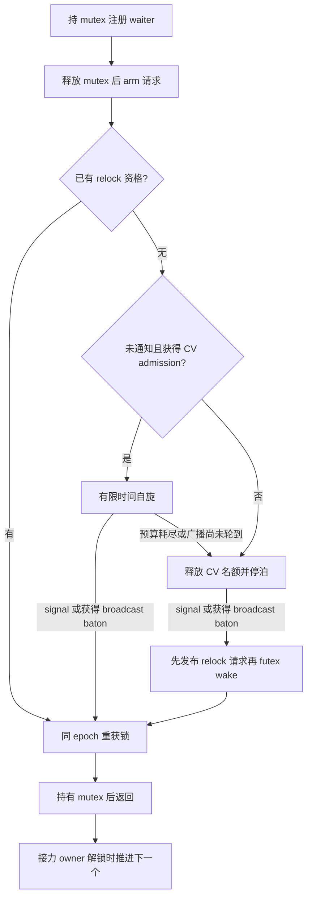

# 条件变量：授权自旋、请求复用与分流唤醒

状态：历史候选设计，完整方案尚未实现。用户随后要求先在 simplify 上归因、仅迁入收益明确的部分；本文保留原设计供对照，不代表当前实现计划。

后续消融修正：signal 独立唤醒在 LevelDB fillrandom 192 线程筛选中仅约 17 Kops/s，叠加 tick 后约 18 Kops/s，低于约 57 Kops/s 的 simplify 基线，因此不迁入。仅增加已获准自旋者对普通任务的调度机会，三轮确认即得到 MCS 约 54%、MCS-TAS 约 188% 的写入提升，读性能基本持平；无需先引入完整 condvar 自旋方案。完整应用回归和具体采用范围以本轮归因记录为准。下文 signal/broadcast 分流、自旋及自适应预算仍属于未采用的候选内容。

已完成的 107 次有效测量、完整 streamcluster 回归和工作区检查见[归因与迁入报告](../benchmarks/leveldb-attribution-20260906/README.md)。

## 目标与基线

保留 simplify 的普通 mutex 性能，引入 fullhook 在短条件等待上的优势，同时保留 broadcast 的接力唤醒。目标是在同一实现中接近 simplify 的 readrandom 与 fullhook 的 fillrandom，并保持完整 streamcluster 的性能和进展性；这些是验证目标，不是已有结果。

固定参考提交：

- simplify：`8fc18994aa51f27b91bf6b490a575a309add8da3`，标准上游 LiTL 适配器、direct futex condvar、relock 请求复用和 mutex parking FIFO。
- fullhook-admission：`4e5998e21c458e9b162855ef3c3d5c7e42b42ebb`，内嵌 raw lock、condvar admission 自旋和扩展 BPF 调度。

192 线程、同一 LevelDB 1.20、30 秒 × 3 的 MCS-TAS 参考均值：

| 工作负载 | simplify | fullhook |
| --- | ---: | ---: |
| readrandom | 950.121 Kops/s | 661.382 Kops/s |
| fillrandom | 51.816 Kops/s | 145.996 Kops/s |

详见[分支测量报告](../benchmarks/leveldb-branches-20260906/README.md)。这是整套分支比较，未分离缓存布局、拦截层、调度及 condvar 的贡献。fullhook MCS 的 fillrandom 有 2/3 超时，不能作为可靠的吞吐量基线，超时根因也尚未确认。

第一版以 simplify 的代码和标准 LiTL 入口为实现基线；当前工作分支中的本文件仅记录设计，不切换分支或改写现有实现。MCS 和 MCS-TAS 共用 condvar 协议，性能验证先从 MCS-TAS 开始，再覆盖 MCS。

## 取舍

| 层次 | 第一版决定 | 原因 |
| --- | --- | --- |
| 普通 mutex | 保留 simplify 的入口、raw lock 布局与算法 | 将 readrandom 的普通锁路径作为对照，避免同时改变多个因素 |
| 条件等待 | 借鉴 fullhook：获得 admission 才短时自旋，之后私有 futex 停泊 | 短等待有机会省去 futex wait/wake |
| 重获锁 | 保留 simplify 的预发布请求，并扩展到自旋路径 | 通知、调度授权与 relock 使用同一个 epoch |
| signal | 每次选中一个 waiter，独立进入 relock | 避免不同 condvar 的通知被同一 mutex FIFO 额外串行化 |
| broadcast | 逻辑通知所有当前 waiter，再通过 mutex FIFO 接力 | 控制集中唤醒；只有拿到接力资格者开始 relock |
| BPF | 基线调度加上 CV 状态识别及必要进展机制，普通锁变化单独评估 | 自旋等待条件与等待锁需要不同路由 |
| pthread 语义 | 保留 simplify 的取消、超时、clockwait、active 生命周期处理 | 性能优化必须维持这些行为 |

继续使用直接 futex；不增加 shadow mutex，不恢复 `COND_VAR` 或 `COND_VAE` 环境变量。不引入每锁 BPF 配额、每锁 DSQ、锁 ID 或应用专用的 writer 优先级。

fullhook 的 initial-exec TLS、紧凑锁布局、TTAS 队首等待以及普通锁 BPF 策略均不整批迁入。后续可独立评估；initial-exec TLS 仅适用于保证启动时 preload 的构建，不能直接改变支持 dlopen 的 direct 库约束。

## 为什么拆分 signal 与 broadcast

LevelDB 的 `DBImpl::Write()` 在一批写入结束后，依次 signal 已完成 writer 的私有 condvar，最后 signal 下一批队首。它们都关联同一个 DB mutex。

simplify 的共同 parking FIFO 因而可能形成：

```text
已完成 writer 1 → 已完成 writer 2 → … → 下一批 writer 队首
```

后面的 waiter 要等接力资格，前面的线程需要逐一重获锁并释放。这个额外顺序可能延迟下一批写入；它不是应用的 writer 队列必须施加的顺序，也不是已经通过采样量化的性能根因。

第一版让 signal 选中的 waiter 直接获得 relock 资格，不进入 broadcast parking FIFO。普通 raw mutex 和全局 admission 继续决定实际获取顺序；“独立唤醒”不代表立即拿到 mutex，不赋予它高于普通 mutex 请求的调度优先级。

broadcast 则把当时 condvar 队列中的所有 waiter 标记为已通知，转入关联 mutex 的 parking FIFO，立即启动第一个已完成 arming 的 waiter。后续接力在对应 relock owner 解锁时发生，取消或退出队列时也必须继续推进。即使通知者没有持有 mutex，首次唤醒也不能依赖未来某次 unlock。

signal 可以越过已经存在的 broadcast parking 队列，但不能夺走其 selected/owner 记录，也不能阻止已有 baton 的释放。保留 broadcast FIFO 内部次序；不承诺 signal、broadcast 与普通锁之间的全局 FIFO。连续 signal 的竞争与 broadcast 尾延迟列为专门验证项。

## 等待状态与请求生命周期

waiter 沿用 simplify 的显式队列节点与私有 futex。新增或明确以下概念；具体字段编码在实现时确定：

- `notified`：本次等待已被 signal/broadcast 选中，退出 condvar 逻辑队列。
- `ready`：已有 relock 资格，同时作为私有 futex 的完成条件。signal 直接赋予资格；broadcast 只有 selected waiter 获得资格。
- `phase`：未 armed、申请 CV 自旋、CV 自旋、准备/已经停泊、relock、完成。
- `delivery`：独立 signal 或 broadcast 接力。取消补偿必须保留通知来源。
- `request`：TLS word 地址、epoch、嵌套标记；沿用已有请求描述符并扩展元数据掩码。

`notified` 和 `ready` 必须分开。广播已经通知但尚未 selected 的 waiter 不能因观察到通知而绕过接力，也不能继续占着 CV 自旋名额等待前驱，应转入停泊。



图中是成功等待路径；超时、取消和嵌套等待按后文处理。

请求有以下不变量：

1. waiter 在旧 mutex 解锁前注册；只有在旧 acquisition 的 `admission_finish()` 完成后才能 arm 新请求。早到的通知先保存在描述符里，不能覆盖旧 `USER_HELD`。
2. 一个外层 cond wait 从 arm 到 relock 完成只使用一个新 epoch。CV 自旋、停泊、通知、重获锁不会再调用普通 `admission_begin()` 重置它。
3. 元数据采用与 `USER_CV` 一致的掩码，ticket 只由 epoch 与 TID 构成。不能把 simplify 的 `+4`/`~USER_FLAGS` 与 fullhook 的 CV 位直接混用；所有生成、比较、续用路径必须同步修改。
4. 保留 epoch 不等于保留 grant。进入 raw 等待队列前要核对调度器状态、当前 CPU、affinity 与完整 ticket；停泊后原名额可以已经释放。raw trylock 成功仍可沿用现有快路径，不必为已拿到的锁申请名额。
5. 一旦加入 raw MCS 队列，就必须完成现有队列协议；不能因为 CV 预算到期或通知状态变化再次停泊。嵌套锁继续共享外层 admission。

## 自旋、通知与 futex 握手

采用 simplify 现有的短队列 guard 保护描述符与阶段切换，维持 `cond guard → mutex parking guard` 的锁顺序。不得在持 guard 时调用 sched_yield 申请 admission、阻塞等待用户 mutex 或进入 raw 锁队列。

成功等待流程：

1. 在持用户 mutex 时注册 waiter，释放 mutex，再 arm 请求。如果已经 ready，跳过 CV admission 和自旋，直接 relock。
2. 仅在无其他外层锁、BPF/admission 有效、预算非零且尚未通知时申请 CV 自旋。发布 `epoch | USER_WAITING | USER_CV`，执行一次 admission 尝试；得到有效 grant 才发布 `USER_SPINNING | USER_CV` 并自旋。该尝试可以包含 yield，因此自旋命中只承诺避免 futex 往返，不能称为完全没有系统调用。
3. notifier 遇到正在申请或正在自旋的 waiter，只更新其通知/资格描述符，由 waiter 在 guard 保护的阶段交接中更新自己的 TLS word。不得由 notifier 和运行中的 waiter 互相覆盖 WAITING/SPINNING 状态。申请过程中到达的通知必须在 yield 返回后重新检查。
4. 自旋者观察到 ready 后清除 `USER_CV`，保持 epoch，检查原 grant，再进入 relock。若未得到资格、申请失败、预算耗尽，或 broadcast 通知了它但尚未轮到，则进入停泊握手。
5. 停泊握手在 parking guard 下重新检查 ready；只有仍需等待时，才清除 CV 活跃状态并发布 parked 阶段。释放 guard 后对私有 futex 执行条件等待。notifier 对 parked waiter 先发布 `epoch | USER_WAITING`，再 release-store ready，最后 futex wake。若通知发生在真正入睡之前，futex 的值比较必须使其不再睡眠。
6. 自旋者/未进入停泊握手的 waiter 不需要 futex wake。parked 标记可以包含“准备调用 futex”的线程，此时一次唤醒可能唤到零人，但不能省略并冒险丢失唤醒。

ready 的发布/观察使用 release/acquire。跨线程发布 request word 必须发生在 ready 与 futex wake 之前。notifier 的发布权限通过 phase 与 guard 交接给出；不能只加几个 relaxed 标志就假定竞态消失。

保留 simplify 对 waiter 栈地址和 TLS request 的生命周期保护：notifier 的最后一次访问及 futex wake 完成前，waiter 不能退出等待帧。必要时保留 parking guard 跨越非阻塞的 FUTEX_WAKE；不得把该要求误用于 FUTEX_WAIT。取得 mutex 后把 broadcast selected 节点转换为 owner 身份，不能让 mutex 保存已经返回的栈指针。

## BPF 路由与进展

| 用户态状态 | 调度行为 |
| --- | --- |
| CV WAITING，无 grant | NORMAL_DSQ，获得运行机会后尝试当前 CPU 空名额；不得排进必须等名额才恢复的 WAITING_DSQ |
| CV SPINNING，有 grant | 保持既有授权，允许通知者和普通任务继续得到运行机会 |
| CV 已停泊、无资格 | 没有活跃 CV 请求；BPF 在停泊回调回收其名额 |
| relock WAITING，无 grant | 不带 USER_CV，进入 WAITING_DSQ；本次 wake 可携带预发布请求 |
| relock/raw SPINNING 或 HELD | 沿用 raw 队列与持锁者的进展规则 |

第一版的 yield 自授予仅新增给 CV 尝试；普通锁维持基线行为。对有 CV grant 的 spinner 增加必要的普通任务服务机会，避免 CPU 都被等待通知的线程占据。普通 raw-lock spinner 的时间片策略和 holder 抢占策略分别做进展验证与消融；不为凑齐“原样基线”而保留已证实的停滞，也不未经测量就整批采用 fullhook 策略。

必须覆盖最后一个 runnable task 的 enqueue/dispatch 进展，必要时采用 `SCX_OPS_ENQ_LAST`，单独记录此类正确性改变的性能影响。

第一版不迁入 fullhook 的无条件 idle select_cpu 直接投递。它可能绕过 enqueue，使预发布 relock 请求未经过 admission 就先运行，随后还得 yield。若以后引入该优化，必须对 relock 请求执行完整授权协议，或保留 enqueue 路由；直接投递 CPU 本身不构成 grant。

BPF 暂时无法及时回收已结束请求时也不得覆盖他人的 owner；重新使用名额仍需完整 ticket 校验。调度器退出、申请失败、CPU 迁移的退化路径必须让线程完成 mutex 协议，不能在用户态等待一个永远不会到来的授权。

## 超时、取消与嵌套

- 延续 simplify 的 CLOCK_REALTIME、CLOCK_MONOTONIC 和 pthread_cond_clockwait 行为。自旋预算按单调时钟计算；等待期限仍按指定时钟判定，不能延后到预算耗尽才处理。
- 超时与通知在 cond guard 下线性化。超时先发生则退出 cond 队列并执行 relock；通知先发生则不再以原 cond deadline 打断已开始的重获锁等待。被 broadcast 通知但未 selected 的 waiter 仍须等待接力资格。
- 取消覆盖 CV admission、自旋、futex 等待和 relock 交界；不在持内部 guard 或已加入 raw 队列时异步拆除节点。扩展已有取消安全区和检查点，确保清理程序最终持有用户 mutex，移除所有队列记录并结束本次请求。
- 取消不能吞掉应交给其他 waiter 的 signal；取消 broadcast selected 或接力 owner 时必须推进后继。调用用户清理程序前解除或转换栈节点引用，并维持 active 计数。
- 等待期间还持有其他锁的线程不新建 CV admission，也不加入串行 broadcast baton；沿用 simplify 的嵌套等待立即唤醒路径，保留外层请求。
- 保留 active waiter 的 destroy 检查，以及无需显式 init 的静态初始化行为。
- 保留 simplify MCS trylock 发布节点时的 acq_rel。该修正与 fullhook 超时的因果关系仍需单独验证，不能把保留修正当作超时已经解决。

## 预算与实现顺序

第一轮使用固定预算做消融，复用已有 `ACCORDIN_CV_SPIN_US` 名称表示“CV 自旋预算”，0 仅禁用自旋，不改变 signal/broadcast 和 relock 语义。候选测量点为 0、5、20、100、1000 µs；1000 µs 是 fullhook 参考配置，不预设为新实现的最优默认值。预算解析应检查范围和溢出。

自适应预算放在固定预算结果之后：只在 CV 慢路径记录自旋命中与耗时，长等待或低命中时减小预算；不在普通 mutex 热路径加入时钟读取或共享统计。具体更新周期和上下限由固定预算实验决定。

分阶段实现与测量，每阶段独立构建目录、记录源码及 DSO 哈希，不新增公开策略开关来替代消融构建：

| 阶段 | 变化 | 要回答的问题 |
| --- | --- | --- |
| A | 原样 simplify 与 fullhook 参考 | 同场复测基线与波动 |
| B | simplify 增加授权 CV 自旋及必要 BPF 支持；保留原通知队列 | 避免 futex 往返本身有多少收益，普通锁是否受影响 |
| C | 在 B 上让 CV 自旋结束后复用 epoch/grant；停泊路径仍保留既有预发布 relock | 是否减少重复申请、yield 和通知到持锁延迟 |
| D | 在 C 上让 signal 独立唤醒，broadcast 保留接力 | 是否缩短下一批 writer 的启动间隔，是否影响 barrier 和公平性 |
| E | 固定 D 后分别评估自适应预算、TLS、TTAS 与普通锁 BPF 变化 | 每项改动是否同时改善或保持目标负载 |

阶段 B 可作为临时消融版本结束 CV 请求再建立 relock 请求；最终 C/D 必须满足本文的同 epoch 协议。所有阶段都要正确处理 notified/ready，不能用破坏 broadcast 接力的实现充当“自旋收益”。

## 验证与判定

正确性检查同时覆盖无 BPF 与有 BPF、两个锁后端、C/C++、NDEBUG，以及线程数大于可用 CPU 的配置：

- 通知发生在旧锁释放前、arm 前、admission yield 中、自旋转停泊边界和 futex 入睡之前。
- 持锁/不持锁的 signal 与 broadcast；多个 condvar 关联同一 mutex；混合 signal/broadcast、连续 signal、重复 barrier。
- 已通知但未 ready 的广播 waiter 必须停泊；selected 取消或退出后后继必须前进；不得以通知状态代替接力资格。
- 超时/取消与通知竞争、单调/实时时钟、静态初始化、active destroy、持外层锁等待。
- 只有最后一个 runnable task、grant 失效、affinity 改变、调度器关闭、已有 raw 节点的进展。

性能运行沿用分支报告的同一 LevelDB 1.20 二进制、种子、192 worker、CPU 0–95、30 秒窗口与 tmpfs；readrandom/fillrandom 至少各 3 次，轮换顺序，噪声影响结论时补充样本。运行完整 streamcluster 192 线程及 192 线程 barrier，避免只优化 writer 链而损失广播场景。

诊断运行与正式吞吐量运行分开。按线程累积后汇总，观察：自旋尝试/命中、futex wait/wake、admission yield、通知到 ready 与 ready 到持锁的延迟、broadcast 队列尾延迟，以及 LevelDB 下一批 writer 启动间隔。最后一个指标需要单独的诊断二进制，不能悄悄改动正式基准。核对加载库、BPF 状态、工作量和输出，串行持有现有 benchmark flock。

采用条件：普通锁/readrandom 没有稳定回退，fillrandom 接近或超过 fullhook 参考，完整 streamcluster 相对 simplify 没有稳定回退，且全部进展与语义检查通过。若未达到，保留各项消融结果定位取舍；不把目标性能写成已达成，也不把超时计作零吞吐量或忽略后计算成功样本的对比均值。
